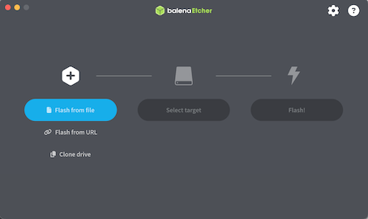

### Ubuntu 26.04 LTSを導入するPCの確認
- mouse DT5-G-B560W11-EX5のメモリを32GBに換装し、1TB SSDと8TB HDDを追加したPCを使用
  - Intel B560 Micro ATX LGA1200
  - Core i5 2.60GHz 6Core 12thread
  - 512GB SSD + **1TB SSD** + **8TB HDD**
  - ~~16GB~~ **32GB** RAM 
  - NVIDIA GeForce RTX 3050 8GB

- PC起動時のオプション(電源投入直後に押す必要がある) **ただし、PCにより異なるため確認が必要**
  - BIOS設定画面の起動 F2キー
  - 起動デバイスの選択画面 F7キー


### 導入メディアの準備
以下は、MacBook Air(macOS Tahoe 26.6.2)で作業を行いました。

- ISOイメージのダウンロード
  - Canonical Ubuntuの[Ubuntuを入手する](https://jp.ubuntu.com/download)サイトからUbuntu Desktop 26.04.1 LTSのISOイメージをダウンロードします

- ダウンロードしたISOイメージの正当性確認
  - [Ubuntu releases](https://releases.ubuntu.com/26.04/)のSHA256SUMSに記載されたhash値(601e30fbf5d97759367c632e2c33630665039b7e2158fd068403da3ccf1bda1f *ubuntu-26.04.1-desktop-amd64.iso)と一致することを確認します
    ```
    % sha256sum ubuntu-26.04.1-desktop-amd64.iso
    601e30fbf5d97759367c632e2c33630665039b7e2158fd068403da3ccf1bda1f  ubuntu-26.04.1-desktop-amd64.iso
    %
    ```
    hashの値が異なる場合はISOイメージのダウンロードをやり直します。

- ISOイメージのUSBメモリーへの書き込み
  - 今回は32GBのUSBメモリ、ISOイメージ書き込みソフトウェアとして[balena](https://etcher.balena.io)の ETCHER FOR MACOS (ARM64) を使用しました。

    1. Flash from fileをクリックし、ダウンロードしたISOイメージを指定する
    2. Select targetとしてUSBポートに接続したUSBメモリーが表示されていることを確認する
    3. Flash!をクリック
