### USBメモリーからの起動と導入

[Ubuntu 26.04 LTSの導入(その1)](https://kazukif-blog.pages.dev/posts/infra/install_ubuntu2604_1/)で作成した導入メディアであるUSBメモリーをPCのUSBポートに挿入する(複数のUSBポートがある場合は、USB3.0のポートを選択してください)。

1. PCの電源を投入直後からF7キーを連続して押し、起動デバイスの選択画面を表示させ、USBメモリーを選択する(この手順は使用PCにより異なるため事前に確認してください)。しばらく待つと以下の画面が表示されるので、"Try to Install Ubuntu"を選択し、Enterキーを押す

    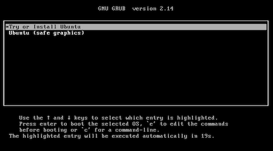

2. しばらくすると、以下の使用する言語を選択する画面が表示されるので 日本語 を選択し、次へをクリックする

    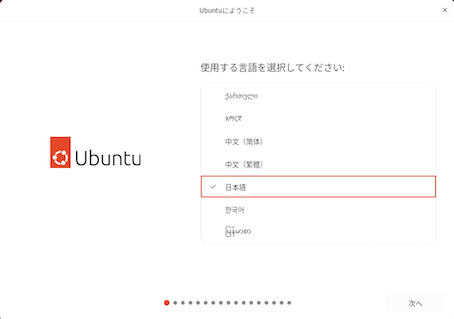

3. 次に、Ubuntu のアクセシビリティをカスタマイズする画面が表示されるが 次へをクリックする(後で変更することは可能です) 

    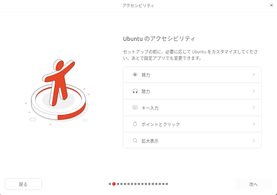

4. 次に、キーボードレイアウトを選択する画面が表示されるので、使用しているキーボードに対応したものを選択し、次へをクリックする(必要に応じて、キーボードをテストできますの項目で確認してください)

    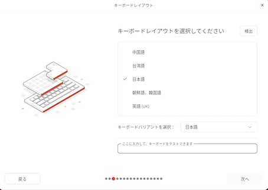

5. 次に、ネットワークに接続の画面が表示されるので、使用しているネットワークを選択して、次へをクリックする

    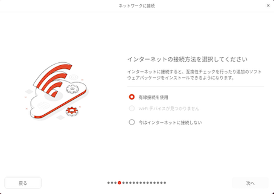

6. 次に、Ubuntuをインストールが選択されていることを確認し、次へをクリックする

    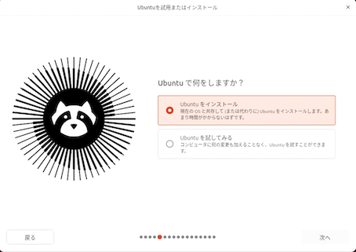

7. 今回は対話式で導入を進めるため、 対話式インストールが選択されていることを確認し、次へをクリックする

    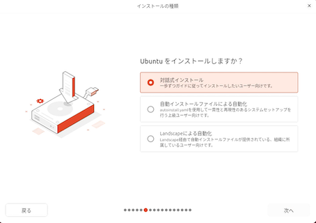

8. 規定の選択が選択されていることを確認し、次へをクリックする

    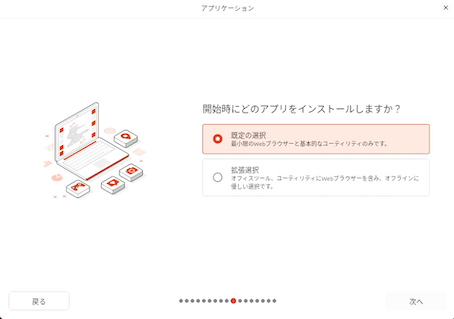

9. コンピュータの最適化の画面では、導入先のPCにNVIDIAのGPUが搭載されているため、1つ目の項目にチェックし、次へをクリックする

    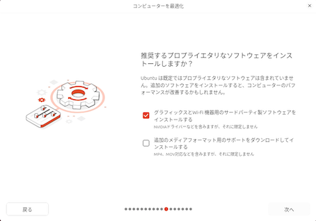

10. ディスクのセットアップでは、導入先に応じていずれかを選択し、次へをクリックする

    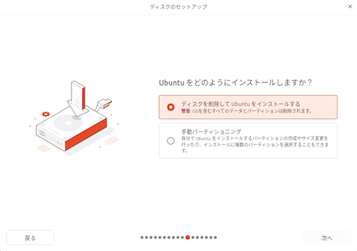

11. 暗号化とファイルシステムでは、いずれかを選択し、次へをクリックする

    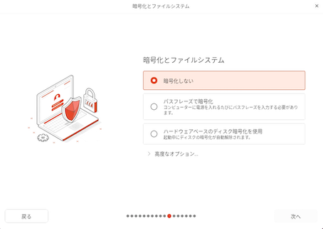

12. アカウントの設定では、あなたの名前・ユーザー名、パスワードを入力し、次へをクリックする

    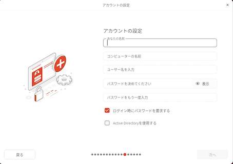

13. タイムゾーンでは、現在地とタイムゾーンが適切であるか確認し、次へをクリックする

    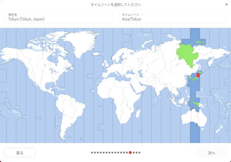

14. 指定したオプションが正しいか確認し、インストールをクリックする

    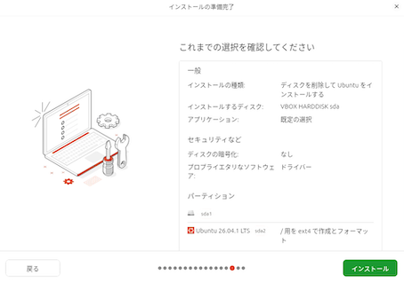

15. インストールが開始されるので、完了まで待ちます。なお、右下のプロンプトの様なアイコンをクリックするとインストール状況が表示されます

    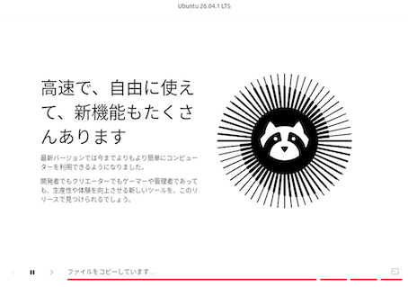   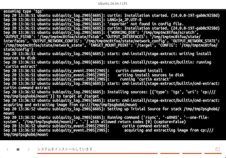

16. インストールが完了したら、今すぐ再起動をクリックする

    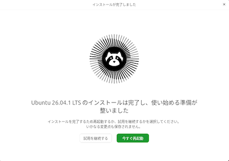

17. 導入に使用したUSBメモリを抜いた後、Enterを押す

    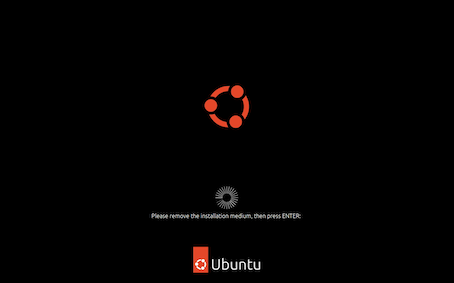

18. インストール時に設定したアカウント名が表示されるのでクリックし、該当するパスワードを入力し、Enterを押す

    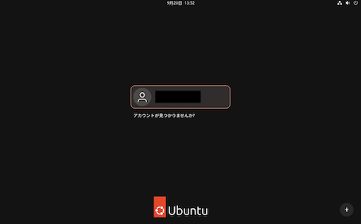

19. 初期設定を行う(使用ユーザーで初めてログインした場合に必要となる)

    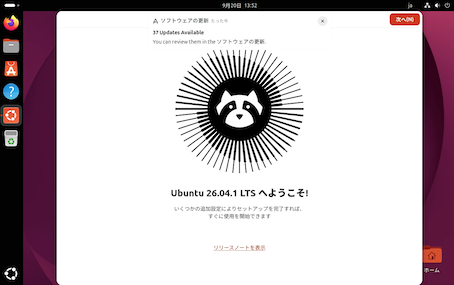    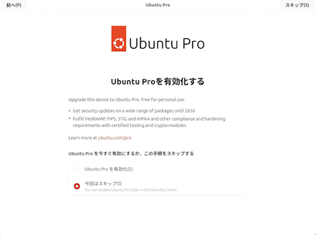    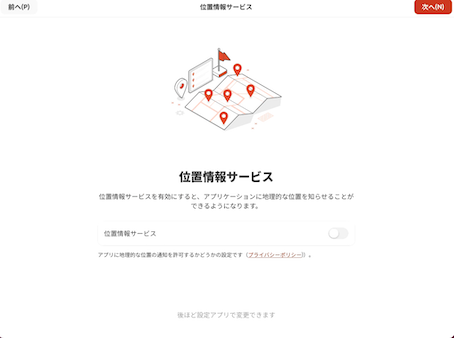    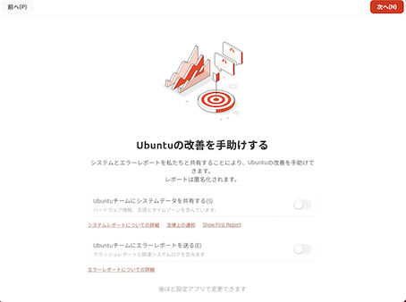    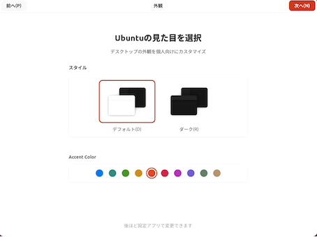    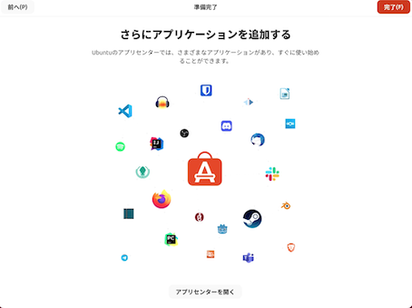

20. 下記の画面が表示されれば、インストール作業は終了となります。

    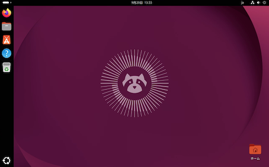

